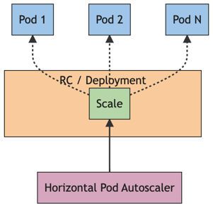

## Horizontal Pod Autoscaling
> [Kubernetes Documentation](https://kubernetes.io/docs/tasks/run-application/horizontal-pod-autoscale/)

- `HorizontalPodAutoscaler`: 자동으로 workload 리소스(ex. Deployment, StatefultSet)를 업데이트 함
  - horizontal scaling: load가 증가하면 pod(클러스터 실행되는 컨테이너 집합)를 더 많이 배포함

### HorizontalPodAutoscaler

- control loop (간헐적 동작)
  - interval: `--horizontal-pod-autoscaler-sync-period` at `kube-controller-manager` (default 15s)

- 메트릭
  - pod 단위 리소스 메트릭: 사용률 값 사용
    1) `HorizontalPodAutoscaler` 대상 pod에 대한 리소스 메트릭 API에서 메트릭을 가져옴
    2) pod의 컨테이너에 대한 사용률 값 계산
    3) 원하는 레플리카의 개수를 스케일하는데 사용되는 비율 생성
  - pod 단위 사용자 정의 메트릭: 원시 값 사용
  - object 메트릭, 외부 메트릭
    1) 문제인 object를 표현하는 단일 메트릭 가져옴
    2) 목표 값과 비교하여 비율 생성

### HPA 설정

- `maxReplicas`: autoscale 시 증가될 최대 pod 개수
- `minReplicas`: autoscale 시 감소될 최소 pod 개수
- `scaleTargetRef`: autoscale 대상 정의
- `targetCPUUtilizationPercentage`: autoscale 기준 CPU 사용률