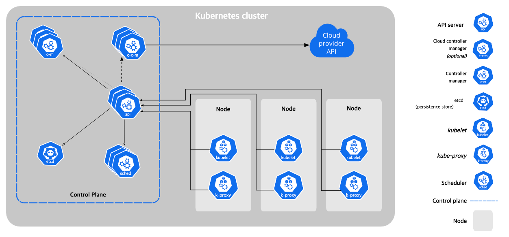

# 1. Cluster 생성하기

## Cluster

여러 노드를 묶어 하나의 자동화된 컴퓨팅 환경으로 추상화 한 것.

> ### 추상화가 갖는 의미?
> 
> 쿠버네티스는 서버 인프라와 관련된 리소스들을 정말 잘 추상화했습니다.
> 
> 클러스터, 노드, 파드 등... **사용자는 서버(클러스터) 구조가 어떻게 되어있는지 몰라도, 서버 자원을 사용할 수 있습니다.**
> Pod를 띄우면 쿠버네티스가 알아서 최적의 노드에 배치해줍니다. 심지어 그 노드가 바빠지면 다른 노드로 재배치하기도 합니다.
> 
> 이런 추상화덕에 서버 관리를 쉽게 할 수 있을 뿐 아니라, 커스터마이징이 가능하고, 쉽게 대체(도커나 containerd로 컨테이너 시스템 교체 등...)가 가능합니다.



## Node

Pod를 띄우고 실행하는 머신.

 - 각 노드는 `kubelet`에 의해 관리됩니다. `kubelet`은 control plane과 통신하거나 컨테이너를 관리하는 역할입니다.
 - `kube-proxy`는 서비스를 구현하는 컴포넌트입니다. 네트워크 규칙(iptables 등)을 관리해서 내/외부와 통신할 수 있도록 해줍니다.
 - `Container runtime`은 실제 컨테이너를 실행하는 컴포넌트입니다. containerd, CRI-O등이 있습니다.

## Control Plane

**클러스터/노드 관리**, 이벤트 처리와 같은 두뇌 역할을 수행하는 노드

- 클러스터에 관한 결정(스케줄링 등...)을 수행한다.
- 이벤트(replica 불충족)을 감지하고 대응한다.
    - 파드가 부족하면 더 생성한다.

### kube-apiserver

쿠버네티스 API를 노출하는 REST API 서버 프로세스

클러스터를 통제하기 위한 각종 API를 제공합니다. 아래와 같이 rest api로 주고받으며 서버를 관리할 수 있습니다.

```json
{
  "kind": "Node",
  "apiVersion": "v1",
  "metadata": {
    "name": "10.240.79.157",
    "labels": {
      "name": "my-first-k8s-node"
    }
  }
}
```

사용자가 매번 이렇게 rest api로 주고받는건 어려우니까, command line으로 쉽게 래핑한 툴이 `kubectl`입니다.

### etcd

모든 클러스터 데이터를 담는 key-value 형태의 저장소

- 쿠버네티스는 로드벨런싱, 스케줄링, 모니터링 등의 조율을 수행한다.
- 조율을 위해서는 클러스터의 상태(노드, 파드, 앱 인스턴스 등)를 알아야 한다.
- 클러스터의 상태가 `etcd`에 저장된다.

### kube-scheduler

새로 생성된 파드를 탐지하고, 실행 계획을 수립하는 프로세스

- 파드가 생성되면, 이 스케줄러에 의해 실행될 노드가 배정된다.
- 노드 배정에는 여러 요소가 고려된다.
    - 리소스 요구 사항
    - 하드웨어/소프트웨어/정책적 제약
    - affinity, anti-affinity 명세
    - 데이터 지역성
    - 워크로드간 간섭
    - 데드라인

### kube-controller-manager

컨트롤러를 실행, 관리하는 프로세스

- 컨트롤러는 `현재 상태를 감시하고, 상태를 조절하는 루프 시스템`를 의미한다.
    - 에어컨과 유사하다. 온도가 낮아지면 잠시 가동을 멈추다가, 다시 더워지면 가동하는 방식으로 동작한다.
- 예를 들어 노드 컨트롤러는 노드가 다운되면, 통지하고 대응하는 컨트롤러이다.

## colima로 kubernetes 환경 구축하기

1. colima 설치 `brew install colima`
2. kubernetes옵션과 함께 colima 실행 `colima start --arch aarch64 --vm-type=vz --vz-rosetta --kubernetes`
3. `kubectl config current-context`로 현재 클러스터가 `colima`가 잘 뜨는지 확인.

> ### colima 시작할 때 붙는 옵션?
> 
> --arch aarch64 --vm-type=vz --vz-rosetta
> 
> Rosetta2 에뮬레이션 옵션으로 colima VM을 생성하는 옵션입니다. Rosetta는 Intel전용 앱을 Apple Sillicon에서 동작하게 해주는 소프트웨어입니다.
> ([참고](https://support.apple.com/ko-kr/guide/security/secebb113be1/web))
> 
> 이 기능은 Colima v0.5.3이상, MacOS 13 이상에서만 동작합니다. ([참고](https://github.com/abiosoft/colima))