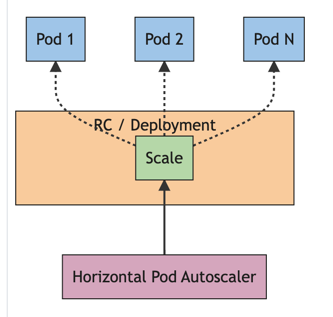

# Horizontal Pod Autoscaling

## Autoscaling의 필요성

 - **트래픽 방어**: 서버에 트래픽이 많아지면, 이를 감당하기 위해 서버를 늘려 대응할 수 있습니다.
 - **비용 절감**: 사실 트래픽 방어는 직접 서버를 많이 늘려서 해결할 수 있습니다. 대신 비용이 많이 들텐데요. Autoscaling은 지금 필요한 만큼만 파드를 만들어 비용을 절감합니다.
 - **효율적인 리소스 사용**: 서버를 필요한 만큼만 만드니, 효율적으로 리소스를 분배해 사용할 수 있습니다.

## HPA 동작 원리



동작방식을 간단하게 요약하면 이렇습니다.

1. 컨트롤러가 파드들의 metric을 수집합니다.
2. 현재 metric을 기준으로, 파드를 얼마나 늘리거나 줄일지 계산합니다.
3. Deployment/ReplicaSet에 계산된 파드 수를 지정해서 파드를 조절합니다.

### 1. 컨트롤러가 파드들의 metric을 수집합니다.

HPA를 정의하면서 `scaleTargetRef`를 쓰게 될텐데요. 이건 어떤 리소스(Deployment/ReplicaSet)에 Autoscaling을 적용할지 정합니다.

```yaml
...
kind: HorizontalPodAutoscaler
spec:
  scaleTargetRef:
    apiVersion: apps/v1
    kind: Deployment
    name: php-apache # php-apache에 HPA를 적용!
...
```

위의 예시에서는 php-apache를 선택했습니다. 그러면 HPA는 php-apache의 `.spec.selector`를 참고해 파드들을 선택합니다.

```yaml
...
kind: Deployment
metadata:
  name: php-apache
spec:
  selector:
    matchLabels:
      run: php-apache # 여기에 맞는 파드들을 선택!
...
```

이렇게 선택된 파드들을 대상으로 metric을 수집합니다. metric은 CPU, Memory, 심지어는 커스텀 메트릭을 지정할 수도 있습니다.
수집된 파드들의 metric은 평균을 취해, 현재 평균 metric을 계산합니다.

이 평균 metric은 이후 파드 사용량 계산식에서 사용됩니다. 이 과정을 컨트롤러가 15초에 (기본값) 한번 씩 수행합니다. 이 시간을 바꾸려면 `--horizontal-pod-autoscaler-sync-period`를 조절하면 됩니다.

### 2. 현재 metric을 기준으로, 파드를 얼마나 늘리거나 줄일지 계산합니다.

```
desiredReplicas = ceil[currentReplicas * ( currentMetricValue / desiredMetricValue )]
```

`currentMetricValue`는 아까 수집한 현재 metric입니다. `desiredMetricValue`은 목표하는 metric값으로, HPA 오브젝트에 정의된 값입니다.

```yaml
kind: HorizontalPodAutoscaler
spec:
  metrics:
  - type: Resource
    resource:
      name: cpu
      target:
        type: Utilization
        averageUtilization: 50 # 이렇게요
```

이렇게 지금 필요한 파드 수를 계산합니다. 그런데 모든 파드가 metric을 주는건 아닙니다. 때론 파드가 뜨고있을 수도 있고, 종료되었을 수도 있죠. 이런 경우에는 그 metric을 수집하진 않습니다.

어차피 컨트롤러가 주기적으로 돌면서 autoscaling하니, 이번 사이클은 넘어가고 다음 사이클에 계산합니다.

> ### replica 개수 산출식에 왜 ceil이?
>
> 유입되는 트래픽을 모두 커버하려면 ceil로 계산해야합니다.
> 
> 예를 들어 현재 320m을 사용중인데, 목표가 100m이라면? 파드를 4개 만들어야합니다.
> 320/100 = 3.2이지만, 320m을 커버하기 위해서는 최소 4개의 파드가 필요하기 때문입니다.

### 준비 작업

컨테이너가 처음 뜰 때는 준비 작업때문에 리소스를 잠깐 많이 사용합니다.
그래서 HPA는 **처음 5분간** 파드의 cpu metric을 수집하지 않습니다. `--horizontal-pod-autoscaler-cpu-initialization-period`를 조절해서 시간(기본 5분)을 바꿀 수 있습니다.

그리고 HPA는 기본적으로 **준비된 파드**를 대상으로만 적용됩니다. 준비된 파드인지 확인하기 위해 readiness를 사용하는데요. readiness는 처음 파드를 시작하고 30초 뒤부터 확인합니다.
이 시간은 `--horizontal-pod-autoscaler-initial-readiness-delay`로 조절할 수 있습니다.

### readinessProbe

주의할 점은 파드의 `readinessProbe`를 잘 설정해주어야 한다는 것입니다. 쿠버네티스는 이 readiness를 보고 파드가 트래픽을 받을 수 있는 상태인지 판단합니다.

HPA도 마찬가지로 **준비된 파드**를 대상으로 autoscaling을 수행하고, Service도 **준비된 파드**를 대상으로 트래픽을 전달합니다.

`readinessProbe` 아얘 기입하지 않으면 쿠버네티스는 파드가 떴을 때 Ready상태로 간주합니다. 그러면 준비되지 않은 파드로 트래픽이 유입될 수 있겠죠. ([예시](https://saramin.github.io/2022-05-17-kubernetes-autoscaling/))

### 3. Deployment/ReplicaSet에 계산된 파드 수를 지정해서 파드를 조절합니다.

지정한 타겟 Deployment나 ReplicaSet의 replica수를 조절합니다. 이 replica를 조절하면 결국 컨트롤러에 의해 실제 파드가 조정됩니다.

> ### ReplicaSet vs Deployment?
>
> **ReplicaSet**은 파드의 개수를 보장해주는 기능을 수행합니다.
>
> **Deployment**는 ReplicaSet + 배포까지 지원합니다. Deployment를 생성하면 하위에 ReplicaSet을 만들어 사용합니다.

## Scaling 정책

정책을 설정해 scale down 속도를 조절할 수 있습니다.

```yaml
behavior:
  scaleDown:
    policies:
    - type: Pods
      value: 4
      periodSeconds: 60
    - type: Percent
      value: 10
      periodSeconds: 60
```

두 가지 방법으로(파드 수, 비율) 정책을 설정할 수 있습니다. 정책이 이렇게 여러 개인 경우에는 개수가 더 많은 정책이 사용됩니다.

예를 들어서 replica가 20개라면? -> Pods는 4개, Percent는 2개이므로 Pods 정책이 선택되어 4개가 down됩니다. `periodSeconds`가 60초이므로 60초 주기로 반복합니다.

scale down을 해야하는 상황이 오면 이 정책에 따라 점진적으로 파드를 줄여나갑니다.
